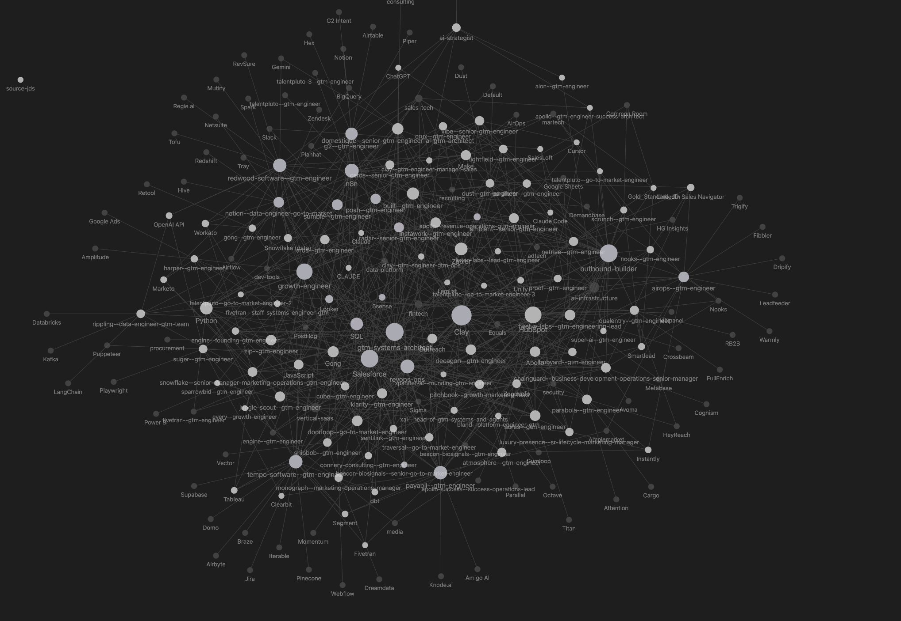

# GTM Job Market Analyzer

A structured market intelligence system for GTM Engineer roles — built with Claude Code and Obsidian.

This vault tracks **61 job descriptions** across the emerging GTM Engineering space, parsing each into structured YAML frontmatter, categorizing by archetype, and generating derived analysis artifacts automatically. The result is a living knowledge graph that surfaces patterns in tools, skills, salary bands, and role archetypes across the market.



## Why This Exists

"GTM Engineer" barely existed as a title two years ago. There's no standard job description, no agreed-upon tool stack, and companies define the role differently depending on their stage and go-to-market motion. If you're hiring for this role, you don't know what to look for. If you're applying, you don't know what to call yourself.

You could dump 100 JDs into ChatGPT and get a summary. This is different — it's a structured data model with a processing pipeline. Every JD is forced into the same schema, normalized against a canonical tool list, and classified into one of five role archetypes. The analysis layer generates market-wide insights automatically. New JDs are auto-fed from Clay and the system gets smarter with every one it processes. The skill isn't the prompting — it's the design of the harness: what fields matter, how to normalize messy data, where to enforce structure, and what gets regenerated vs. what persists.

**The approach works for any emerging role.** Fork this, swap in your own JDs — product management, data engineering, DevRel, whatever space is too messy to hire for or evaluate cleanly. Three use cases:

1. **Job search** — Show me what the market actually wants. Where are my gaps? Which roles are the best fit for my profile?
2. **Market intelligence** — You're at a company and you want to monitor how the market is evolving. What tools are becoming table stakes? What new responsibilities are showing up? How does your GTM stack compare to what others are building?
3. **Product-market alignment** — You sell a product to this ICP. This dataset shows you exactly what your champion's job description looks like, which tools sit next to yours in the stack, and how to position your product against the jobs to be done inside their actual responsibilities.

## Architecture

```
Raw JD text
  → Structured YAML frontmatter (40+ fields per JD)
    → Derived analysis artifacts (tool frequency, skill tiers, salary bands)
      → Obsidian graph (wikilinked tools, archetypes, companies)
```

**The pipeline:**
1. JDs are ingested via `/bulk-add` (Clay CSV) or `/add` (single paste/URL)
2. Each JD is parsed into structured markdown with YAML frontmatter — company, title, tools, skills, archetype, salary, and more
3. `/analyze` regenerates all analysis artifacts from the structured data
4. Obsidian renders the vault as an interlinked knowledge graph via wikilinks

## What's Inside

| Folder | Purpose | Count |
|---|---|---|
| `JDs/` | Parsed job descriptions — one file per role | 61 |
| `Dream/` | Aspirational stretch roles — gap analysis only | 7 |
| `Analysis/` | Generated market intelligence artifacts | 6 |
| `Hubs/Tools/` | Auto-generated hub pages for tools appearing in 3+ JDs | 34 |
| `Hubs/Archetypes/` | Hub pages for each role archetype | 5 |
| `Context/` | Living reference docs (Tags, Archetypes) | 3 |
| `Raw/` | Original unmodified source data | 1 |
| `Examples/` | Gold standard parsing reference | 1 |

## Analysis Artifacts

Generated from structured JD data — not hand-written:

| Artifact | What It Shows |
|---|---|
| **Tool Frequency Map** | 124 tools ranked by adoption — table-stakes (60%+), differentiator (25-59%), rare (<25%) |
| **Skills Tier Map** | Required vs. preferred skills with frequency tiers |
| **Role Archetype Clusters** | 5 archetypes with JD membership and distinguishing traits |
| **Salary Bands** | Compensation ranges segmented by archetype |
| **Preference Alignment** | JDs ranked by role-preference fit signals |
| **Fit Gap Analysis** | Personal skill gaps and "if you learned X" leverage analysis |

## The Five Archetypes

Every JD maps to a primary (and optional secondary) archetype:

1. **Outbound Builder** — Signal-based prospecting, enrichment pipelines, cold outbound at scale
2. **RevOps Architect** — CRM systems, lead routing, attribution, pipeline reporting
3. **Growth Hacker** — PLG experiments, conversion optimization, A/B testing
4. **Marketing Ops** — Campaign automation, lifecycle marketing, email systems
5. **Full-Stack GTM** — End-to-end ownership across multiple GTM motions

## Graph View

The vault is designed for [Obsidian](https://obsidian.md). Every JD links to its archetype hub, tool hubs, and company type tags via wikilinks. The graph view reveals clustering patterns — which tools co-occur, which archetypes share tool overlap, and where the market is fragmenting.

## Tech Stack

- **Claude Code** — AI-powered parsing, classification, and analysis generation
- **Obsidian** — Graph visualization and knowledge management
- **Structured Markdown** — YAML frontmatter as the data layer, markdown as the presentation layer
- **Context Engineering** — Slash commands, living context docs, and compound loops that improve parsing rules over time

## Context Engineering Approach

The system uses a layered context architecture:

- **Tags.md** — Canonical tool names with alias mapping (124 tools). Ensures "SFDC" and "Salesforce" resolve to the same node.
- **Archetypes.md** — Five archetype definitions with classification criteria. Every JD gets mapped to one.
- **Slash commands** — `/bulk-add`, `/add`, `/analyze`, `/gap` each load only the context files they need. No command loads everything.
- **Compound loop** — When a parsing error occurs, the rules update to prevent recurrence. The system gets better with every JD processed.

## Numbers

- **61** JDs parsed from the active market
- **7** Dream roles tracked for gap analysis
- **124** tools normalized to canonical names
- **5** role archetypes identified
- **34** tool hub pages (tools appearing in 3+ JDs)
- **6** analysis artifacts auto-generated

---

Built by [Lucas Manley](https://www.linkedin.com/in/lucasmanley/) as a context engineering showcase.
